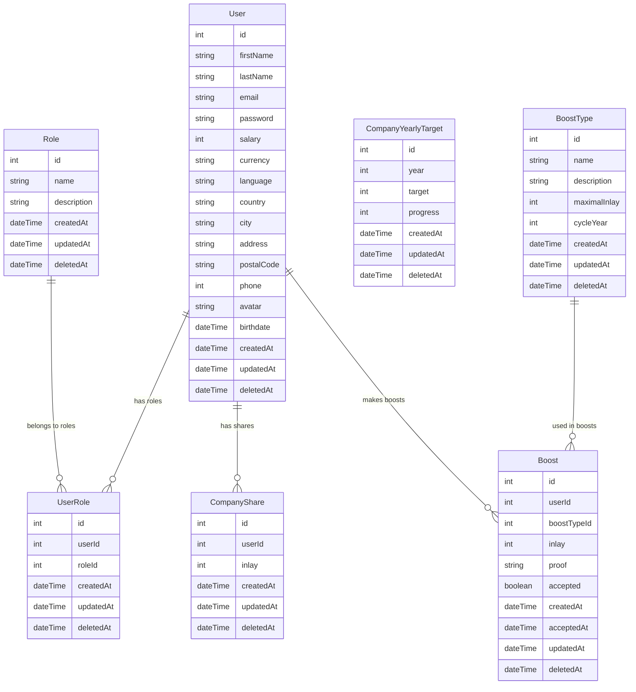

# Data structuur

## Inhoudsopgave

- [User](#user)
- [Role](#role)
- [UserRole](#userrole)
- [CompanyYearlyTarget](#companyyearlytarget)
- [CompanyShare](#companyshare)
- [BoostType](#boosttype)
- [Boost](#boost)

## User

In de user structuur worden de gegevens van de gebruiker opgeslagen. 

De user structuur bevat de volgende velden:

- `id` ```int``` (uniek) - Het id van de gebruiker.
- `firstName` ```string``` - De voornaam van de gebruiker.
- `lastName` ```string``` - De achternaam van de gebruiker.
- `email` ```string``` - Het emailadres van de gebruiker.
- `password` ```string``` - Het wachtwoord van de gebruiker.
- `salary` ```int``` - Het salaris van de gebruiker.
- `currency` ```string``` - De valuta die de gebruiker gebruikt.
- `language` ```string``` - De taal die de gebruiker spreekt.
- `country` ```string``` - Het land waar de gebruiker woont.
- `city` ```string``` - De stad waar de gebruiker woont.
- `address` ```string``` - Het adres van de gebruiker.
- `postalCode` ```string``` - De postcode van de gebruiker.
- `phone` ```int``` - Het telefoonnummer van de gebruiker.
- `avatar` ```string``` - De avatar van de gebruiker.
- `birthdate` ```dateTime``` - De geboortedatum van de gebruiker.
- `createdAt` ```dateTime``` - De datum en tijd waarop de gebruiker is aangemaakt.
- `updatedAt` ```dateTime``` - De datum en tijd waarop de gebruiker voor het laatst is geüpdatet.
- `deletedAt` ```dateTime``` - De datum en tijd waarop de gebruiker is verwijderd.

## Role

In de role structuur worden de gegevens van de rol opgeslagen. 

De role structuur bevat de volgende velden:

- `id` ```int``` (uniek) - Het id van de rol.
- `name` ```string``` - De naam van de rol.
- `description` ```string``` - De beschrijving van de rol.
- `createdAt` ```dateTime``` - De datum en tijd waarop de rol is aangemaakt.
- `updatedAt` ```dateTime``` - De datum en tijd waarop de rol voor het laatst is geüpdatet.
- `deletedAt` ```dateTime``` - De datum en tijd waarop de rol is verwijderd.

## UserRole

In de user_role structuur worden de gegevens van de relatie tussen de gebruiker en de rol opgeslagen.

De user_role structuur bevat de volgende velden:

- `id` ```int``` (uniek) - Het id van de relatie.
- `userId` ```int``` - Het id van de gebruiker.
- `roleId` ```int``` - Het id van de rol.
- `createdAt` ```dateTime``` - De datum en tijd waarop de relatie is aangemaakt.
- `updatedAt` ```dateTime``` - De datum en tijd waarop de relatie voor het laatst is geüpdatet.
- `deletedAt` ```dateTime``` - De datum en tijd waarop de relatie is verwijderd.

## CompanyYearlyTarget

In de companyYearlyTarget structuur worden de gegevens van het jaarlijkse doel en de voortgang van het bedrijf opgeslagen.

De companyYearlyTarget structuur bevat de volgende velden:

- `id` ```int``` (uniek) - Het id van het jaarlijkse doel.
- `year` ```int``` - Het jaar waarop het doel betrekking heeft.
- `target` ```int``` - Het doel dat het bedrijf wil bereiken.
- `progress` ```int``` - De voortgang van het bedrijf.
- `createdAt` ```dateTime``` - De datum en tijd waarop het doel is aangemaakt.
- `updatedAt` ```dateTime``` - De datum en tijd waarop het doel voor het laatst is geüpdatet.
- `deletedAt` ```dateTime``` - De datum en tijd waarop het doel is verwijderd.

## CompanyShare

In de companyShare structuur worden de gegevens wat het aandeel een user heeft in het bedrijf opgeslagen.

De companyShare structuur bevat de volgende velden:

- `id` ```int``` (uniek) - Het id van het aandeel.
- `userId` ```int``` - Het id van de gebruiker.
- `inlay` ```int``` - Het bedrag dat de gebruiker heeft geïnvesteerd.
- `createdAt` ```dateTime``` - De datum en tijd waarop het aandeel is aangemaakt.
- `updatedAt` ```dateTime``` - De datum en tijd waarop het aandeel voor het laatst is geüpdatet.
- `deletedAt` ```dateTime``` - De datum en tijd waarop het aandeel is verwijderd.

## BoostType

In de boostType structuur worden de gegevens van het type boost opgeslagen.

De boostType structuur bevat de volgende velden:

- `id` ```int``` (uniek) - Het id van het type boost.
- `name` ```string``` - De naam van het type boost.
- `description` ```string``` - De beschrijving van het type boost.
- `maximalInlay` ```int``` - Het maximale bedrag dat geïnvesteerd kan worden in deze boost.
- `cycleYear` ```int``` - Het aantal jaar dat de boost loopt.
- `createdAt` ```dateTime``` - De datum en tijd waarop het type boost is aangemaakt.
- `updatedAt` ```dateTime``` - De datum en tijd waarop het type boost voor het laatst is geüpdatet.
- `deletedAt` ```dateTime``` - De datum en tijd waarop het type boost is verwijderd.

## Boost

In de boost structuur worden de gegevens van de boost opgeslagen.

De boost structuur bevat de volgende velden:

- `id` ```int``` (uniek) - Het id van de boost.
- `userId` ```int``` - Het id van de gebruiker.
- `boostTypeId` ```int``` - Het id van het type boost.
- `inlay` ```int``` - Het bedrag dat de gebruiker heeft geïnvesteerd.
- `proof` ```string``` - Het bewijs dat de gebruiker heeft geleverd.
- `accepted` ```boolean``` - Of de boost is geaccepteerd.
- `createdAt` ```dateTime``` - De datum en tijd waarop de boost is aangemaakt.
- `acceptedAt` ```dateTime``` - De datum en tijd waarop de boost is geaccepteerd.
- `updatedAt` ```dateTime``` - De datum en tijd waarop de boost voor het laatst is geüpdatet.
- `deletedAt` ```dateTime``` - De datum en tijd waarop de boost is verwijderd.

## Mermaid diagram



## Relaties

- Een gebruiker kan meerdere rollen hebben.
- Een rol kan aan meerdere gebruikers worden toegekend.
- Een gebruiker kan meerdere aandelen hebben.
- Een gebruiker kan meerdere boosts maken.
- Een boosttype kan in meerdere boosts worden gebruikt.
- Een boost kan maar één boosttype hebben.
- Een boost kan maar één gebruiker hebben.
- Een gebruiker kan meerdere boosts maken.
- Een gebruiker kan meerdere aandelen hebben.