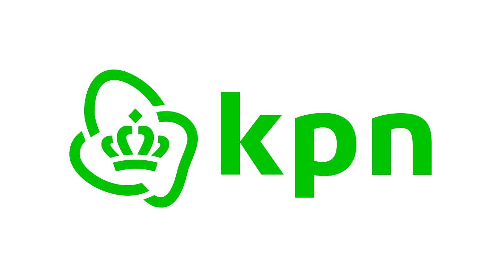

[//]: # (Logo KPN die staat in de assets folder)

## Inhoudsopgave

1. [Inleiding](#inleiding)
2. [Organisatorische Context](#organisatorische-context)
3. [Stakeholders](#stakeholders)
4. [Aanleiding](#aanleiding)
5. [Aanpak](#aanpak)
6. [Conclusie](#conclusie)

## Inleiding
Dit document is een visiescopedocument waar we gaan kijken naar het bedrijf, aanleiding van het probleem, 
aanpak van het probleem en tenslotte een conclusie van het project. Er komt bij KPN een nieuwe cao,
waarbij er een systeem moet worden ontwikkeld voor de stakeholder van KPN, waar ze een keuze maken
van het soort salarisstructuur genaamd: flex & boost. Waarbij we de keuze duidelijk moeten laten zien en simpel
uitleggen, en verder moet de medewerker zijn keuze kunnen gaan maken. Maar eerst gaan we kijken wat het bedrijf is
en wat ze doen. 

## Organisatorische Context
KPN is een van de grootste technologiebedrijven in Nederland. Het is opgericht in 1989 na de splitsing van de PTT.
Sindsdien is KPN zelfstandig en speelt het een cruciale rol in de Nederlandse digitale infrastructuur. Het bedrijf 
is bezig met de ontwikkeling van de technologie en door de groei van het internet en de opkomst van nieuwe 
technologieën, wat leidt tot innovaties en uitbreiding van hun diensten. Ze bieden verschillende soorten 
diensten aan zoals mobiele telefonie, internet, televisie, en cloudoplossingen. Met meer dan 10 miljoen mobiele
abonnementen en 4,8 miljoen glasvezelaansluitingen verbindt KPN miljoenen klanten door heel Nederland. Het doel 
van KPN is om iedereen een zorgeloos en altijd iedereen te verbinden, en dat moet op een duurzame manier. Misschien
heb je het al door, maar KPN is een duurzaam bedrijf en de focus ligt op duurzaamheid. Ze zijn sinds 2015 
volledig klimaatneutraal en behoort tot een van de duurzaamste technologiebedrijven ter wereld.  

### Stakeholders
De stakeholders waar we ons op richten zijn vooral de medewerkers van KPN. Zij zijn degenen die een nieuw cao-contract 
krijgen en niet bijvoorbeeld mensen die als zzp bij KPN werken. Verder zijn de stakeholders ook de leidinggevende van 
de KPN en mensen in de hr. 

## Aanleiding
Bij KPN introduceren ze een nieuwe cao, wat betekent dat de loonstructuur van de medewerkers gaat veranderen. 
Medewerkers krijgen de mogelijkheid om een eigen cao samen te stellen, genaamd flex&boost. De medewerkers 
van KPN kunnen dan keuzes maken binnen de flex- en booststructuur. De keuze kan ingewikkeld zijn, omdat er best
veel dingen komen kijken. Zoals of je wilt investeren binnen het bedrijf of voor jezelf.  
Bij beide structuren kan je keuzes gaan maken die jij wilt in je cao en wij moeten ervoor zorgen 
dat alle informatie duidelijk en overzichtelijk is van die structuur. Ook moeten we mogelijkheid geven 
dat de medewerkers hun contract kunnen samenstellen. Het doel is om een systeem te bouwen waarbij de medewerkers
van KPN, alle informatie duidelijk kunnen vinden en hun keuzes maken binnen de flex- en booststructuur.

## Aanpak
#### Knelpunten: 
- De meeste medewerkers lezen de cao niet en er zijn veel onduidelijkheden, 
en weten niet wat de verschillen zijn tussen de twee opties.
- Welke acties de medewerkers missen van de cao.
- Duidelijkheid voor mensen in het buitenland. 

#### Milestones en user stories:
- Documentaties schrijven 
- Ontwerp gaan maken 
- inloggen met API 
- Deployment voor de applicatie 
- Een admin page moet komen
- Accessibility voor de mensen met een beperking
- Wat een user kan investeren in de cao 
- De user stories definiëren: Als {user} wil ik {functionaliteit}, zodat {doel}

#### Ontwerp en visualisatie:
Er worden wireframes gemaakt voor de applicatie, waarbij de focus ligt op de gebruikerservaring. De wireframes 
worden gemaakt in Figma. Waar er een inlogpagina is, een admin-pagina en een pagina waar de medewerkers hun keuze
zien en kunnen maken.

#### Documentatie en communicatie: 
Alle documentatie wordt bijgehouden in de repository in GitHub. Je kan daar de DoD, het planboard, milestones, wireframes, etc. vinden. 
Er wordt gebruikgemaakt van scrum, waarbij er elke week een sprint wordt gehouden en begin van de week een sprintmeeting
is met het groepje. 
Aan het einde van de week komen er dan stand-ups waarbij iedereen vertelt wat hij heeft gedaan en wat de volgende keer 
beter kan. 

## Conclusie
Kortom, in dit visie-scope-document hebben we gekeken naar het bedrijf KPN, de aanleiding van het probleem en 
aanpak voor het probleem. We gaan dus een systeem bouwen waarbij de medewerkers van KPN een cao samenstellen binnen de 
flex- en booststructuur. De uitdaging is om de keuze duidelijk en overzichtelijk te maken voor de medewerkers
bij KPN. We werken met scrum en hebben in het begin documentatie geschreven en wireframes gemaakt.
De volgende stap is om de applicatie te gaan bouwen en te gaan testen.

