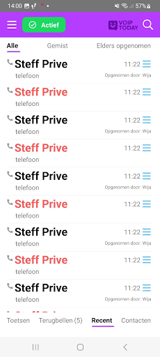
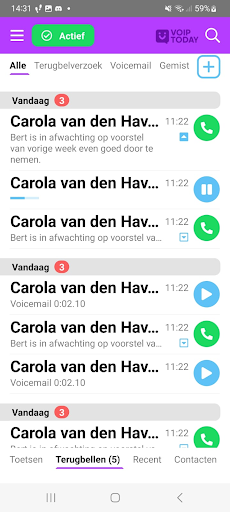
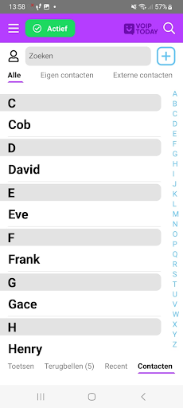
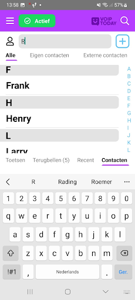
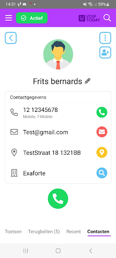

# 📞 Voip Today – Functionaliteiten en Status
Voip Today is bijna voltooid en biedt een aantal handige functies die het communicatieproces verbeteren. Hieronder een overzicht van de belangrijkste onderdelen van de app.

---

## 📲 Bellen op afstand
Gebruikers kunnen om de homepagina van de app mensen bellen. Ze moeten dan hun telefoonnummer in typen of je kan zoeken in je contacten en dan kan je aanklikken wie je wilt bellen. Als je gebeld wordt krijg je een inkomende oproep, als je die weigert ga je terug naar de homepagina. Als je wilt bellen  moet je wel eerst de pincode hebben ingevoerd, als je dat niet hebt gedaan kunnen ze je wel opnemen, maar niet in de app komen, en dus niet naar de incall pagina komen. Als je dan de pincode hebt ingevuld, word je wel direct naar de incall pagina geleid. Als je helemaal niet ingelogd bent, kun je helemaal niet gebeld worden. Ook als je de app niet open hebt staan kan je niet gebeld worden. Het bellen werkt alleen als beide gebruikers de app open hebben staan, als je de app op de achtergrond hebt werkt het ook. Dit moest nog aan de api toegevoegd worden.

| Hoofdscherm | Bellen | Gebeld worden |
|-------------|--------|----------------|
|  |  |  |

---

## 📞 Incall-pagina

Voip Today heeft ook een call-pagina waar je de call weer uit kan gaan, je kan de persoon waarmee je in de call zit doorverbinden, je kan jezelf muten of op speaker zetten en je kan iemand in de wachtstand zetten. Iemand toevoegen aan het gesprek werkt niet, omdat als ik de functie uitvoerde om dat voor elkaar te krijgen, de app crashte, omdat het te veel data kost, dus dat moet nog opgelost worden. Ook kan je maar 1 persoon in de wachtrij zetten en kan je dan nog niet iemand anders bellen. Wel kan je navigeren naar alle pagina’s. Het enige verschil is dat er bovenaan de pagina wordt aangegeven dat de gebruiker in een gesprek is en kan je makkelijk teruglinken naar de inCall pagina, ook kun je zien met wie je aan het bellen bent en de tijd van hoelang je in de call zit. Wanneer het gesprek is beëindigd, verdwijnt de balk vanzelf.

| Incall-pagina                       | incall toetsen|
|-------------------------------------|----------------|
|  |  |

---

## 🔐 Inloggen en pincode

Gebruikers kunnen inloggen in de app door een pincode in te voeren. Dit zorgt voor extra beveiliging en voorkomt dat ongeautoriseerde gebruikers toegang krijgen tot de app. Als een gebruiker wordt gebeld terwijl hij niet is ingelogd, kan hij nog steeds opnemen. Hij wordt dan niet doorgestuurd naar de incall-pagina, dan moet hij eerst de pincode invullen en dat wordt hij meteen doorgestuurd naar de incall-pagina. Ook kan je als je de eerste keer de app opent je eigen pincode aanmaken.

| Pincode aanmaken                           | Inloggen met pincode                        | Inloggen met email                      |
|--------------------------------------------|---------------------------------------------|-----------------------------------------|
|  |  |  |

---

## 📈 Recente calls en terugbelverzoeken

Ook kun je in Voip Today zien wie gebeld hebt en of je gemiste oproepen, als je op de contact knop drukt ga je naar de contacten overzicht en als je de contacten nog niet hebt toegevoegd krijg je een optie om het contact toe te voegen.  Ook kan je terugbelverzoeken aanmaken en versturen naar je contacten, hierin kan je een bericht versturen om een afspraak te maken om te bellen. Het aanmaken en versturen werkt nog niet, hiervoor moet nog een functie in de API gemaakt worden, nu komt de data uit een array.

| Recente calls | Terugbelverzoeken | terugbelverzoeken aanmaken |
|----------------|-------------------|----------------------------|
|  |  |  |

---

## 👥 Contactenbeheer

Voip Today biedt ook de mogelijkheid om contacten te bekijken en te doorzoeken. De app filtert de gegevens van de contacten in alfabetische volgorde en je kan zelf ook contacten zoeken met de searchbar. Ook kun je aan de rechterkant op de letters drukken en dan scrolt de app naar de letter waar je op geklikt hebt. Je kan ook meer informatie over je contact vinden door op het contact te drukken. De bedoeling is dat je hier meer functies kan uitvoeren over het contact, zoals het het contact veranderen, verwijderen, blokkeren en nog meer, alleen is dat nog niet gemaakt in de API. Er is ook een pagina om contacten toe te voegen, alleen deze werkt nog niet, doordat de contacten niet uit de database komen, maar uit een array, net als alle data.

| Contactenpagina | Contact zoeken | Contactdetails | Contact aanmaken |
|------------------|----------------|-----------------|------------------|
|  |  |  |  |

---

🎯 **Volgende stappen:**
- API-functies implementeren voor contacten en terugbelverzoeken
- Ondersteuning toevoegen voor bellen bij gesloten app
- Crashes oplossen bij toevoegen deelnemers aan call

